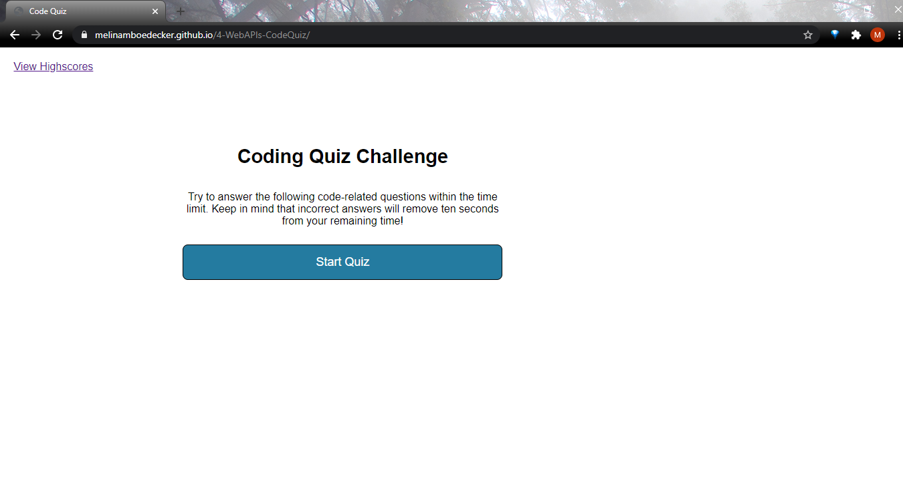

# 4-WebAPIs-CodeQuiz
4: Coding Quiz 

## Description:
This is a timed coding quiz with multiple choice questions created with Java Script for the fourth homework for full stack coding bootcamp. This quiz has a 75 second time limit, and if the user gets the incorrect answer ten seconds are removed from the remaining time. The user will get 10 points for each correctly answered question and a final score will display at end of the quiz.  There is also a high scores board that can be accessed from the start page or at the end after initials are entered. The initials and scores are stored in local storage and displayed in order with high scores at the top on the high scores page. 

## Screenshot

## Link
https://melinamboedecker.github.io/4-WebAPIs-CodeQuiz/